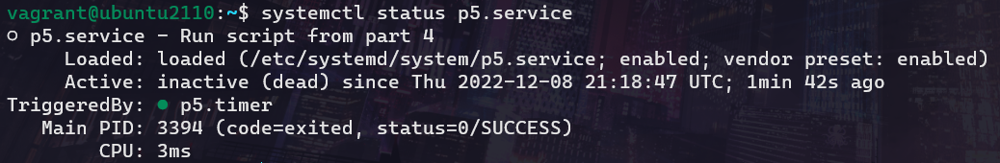

# ACIT 2420 Final Exam

*Aaron Zhang*

*A01316218*

## Part 1

```
sudo apt update
sudo apt upgrade
```

## Part 2

> :%s/V/C/g

> :%s/eco/echo/g

> :%s/numbs/:digit:/g


## Part 3

`man journalctl -K "boot"`


`man journalctl -K "priority"`


`man journalctl -K "json"`


**Working command:**


## Part 4

**find_users script version 1:**
```bash
#!/bin/bash

printf "Regular users on the system are:\n"
grep ':[1-5][0-9][0-9][0-9]:' /etc/passwd | awk -F: '{print $1 " " $3 " " $7}'

printf "\nUsers currently logged in are:\n"
users
```

**Output of find_users v1:**


## Part 5

`sudo vim /etc/systemd/system/p5.service`
```ini
[Unit]
Description=Run script from part 4

[Service]
ExecStart=/bin/bash /home/vagrant/find_users

[Install]
WantedBy=multi-user.target
```

**Status of p5.service:**


*Note: p5.service is located in /etc/systemd/system*

## Part 6

`sudo vim /etc/systemd/system/p5.timer`

```ini
[Unit]
Description=Timer for p5.service

[Timer]
OnBootSec=1min
OnUnitActiveSec=1d
Unit=p5.service
Persistent=true

[Install]
WantedBy=timers.target
```

**Start, enable, status for p5.timer:**


**Status of p5.service:**
